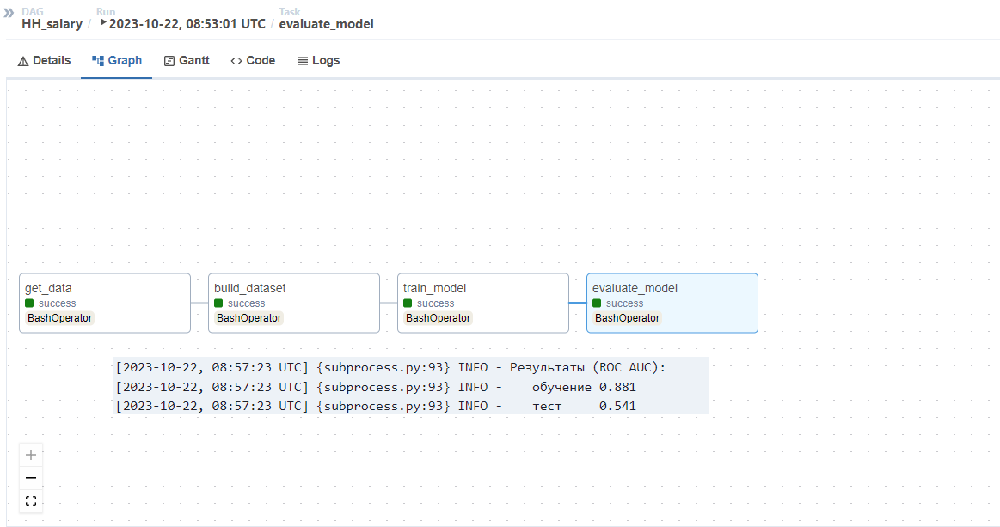
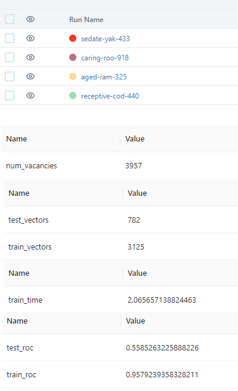

# Лабораторная УрФУ MLops: xFlow

Все сделал в `docker`. Контейнеры собраны с пробросом `CUDA`, для корректной настройки - [документация](https://learn.microsoft.com/ru-ru/windows/ai/directml/gpu-cuda-in-wsl).

> Главные папки airflow и mlflow пробрасываются на хост для дальнейшей работы (после рестарта контейнера). Так же докеры крутятся с открытой консолью, что тоже не очень DevOps 😐.

**Виртуальное окружение создавать в докере не стал, так как получается слишком много слоев изоляции 😊**.

## AirFlow

> Размер контейнера (после иницализации) **~14 Gb**. Контейнер сам пересобрал, так как релиз слишком большой и раскатывает продакшн инфраструктуру (redis, postgres и прочие радости), плюс в стандарте карточка не пробрасывается, а как нам в ML без GPU😁.

Билд контейнера:

```bash
cd ...\xFlow\Airflow\
docker build --tag service/airflow ./
```

`tag` можно указать любой, какой нравится.

Для запуска в файле `\xFlow\Airflow\start.bat` поменять папку для маппинга скриптов внутрь контейнера, (в моем случа: `e:\ML-OPS\xFlow\scripts`),
а также папку airflow (в моем случае `e:\ML-OPS\xFlow\main_folders\Airflow`):

```bash
docker run --gpus all -it --rm -p 8080:8080 -d -v e:\ML-OPS\xFlow\scripts:/scripts -v e:\ML-OPS\xFlow\main_folders\Airflow:/root/airflow service/airflow
```

**!!ПЕРЕД ЗАПУСКОМ СОЗДАТЬ ПАПКИ, КОТОРЫЕ МОНТИРУЮТСЯ!!**

Порты, при желании тоже можно поменять.
После запуска (`.\start.bat`) подключиться к контейнеру (например через `Docker Desctop`) и инициализировать Airflow:

```bash
/init_airflow.sh
```

В процессе попросит пароль, пользователь в Airflow:

* username `Admin`
* firstname `admin`
* lastname `test`
* email `root@root.local`

После инициализации Airflow запустится в фоновом режиме. Доступ к консоле останется. Для проверки идем в браузер `127.0.0.1:8080`, если попросит данные для входа и потом покажет дашборд - все работает.

Для добавления `DAG` - копируем скрипты в примотнированную папку (в моем случае `e:\ML-OPS\xFlow\main_folders\Airflow\dags`) и ждем, пока airflow их подцепит. Вызываемые скрипты размещаем в scripts (в моем случае `e:\ML-OPS\xFlow\scripts`), обратите внимание, что внутри контейнера точка монтирования scripts - `/scripts` (из корня).

## MLFlow

Сборка контейнера:

```bash
cd \xFlow\MLFlow
docker build --tag service/mlflow ./ 
```

Для запуска контейнера используется скрипт `\xFlow\MLFlow\start.bat`. При необходимости - заменить маппинг папки с артефактами, папку скриптов и маппинг портов

```bash
docker run -it --rm -p 5000:5000 --name mlflow -d -v e:\ML-OPS\xFlow\artefacts:/artifacts -v e:\ML-OPS\xFlow\scripts\mlflow:/scripts service/mlflow
```

**!!ПЕРЕД ЗАПУСКОМ СОЗДАТЬ ПАПКИ, КОТОРЫЕ МОНТИРУЮТСЯ!!**

Порты, при желании тоже можно поменять.
После запуска (`.\start.bat`) подключиться к контейнеру (например через `Docker Desctop`) и инициализировать MLFlow:

```bash
/init_mlflowsh
```

Будет запущен сервер (проверить: http:/127.0.0.1:5000, порт по умолчанию `5000`)

## Задача

> Так как цель практики MLops - задача очень далека от практики. Если делать хорошо, то в срок точно ничего не сдать. Возможно, если будет время, можно аналитику покрутить и до ума довести. Может даже одностраничник сделать

* > Источник данных: [hh](https://hh.ru)
* > Домены ML: nlp, classic ML
* > Зачем пайплайн: рынок меняется, оценки ползут. Если постоянно собирать и пересчитывать будут данные о динамике рынка вакансий.

Постановка задачи:

**По тексту `responsibility` предсказать зарплату (когорту) [1] и потребность в специалисте (когорта, чем меньше время существования вакансии тем выше потребность в текущее время) [2]**

Что сделать:

* два набора лейблов - зп и время онбординга (считаем, от текущего времени)
* токенизация
* моделька - вот тут прям лениво крутить трансформеры - просто скормим XGBoost 😑

В `reseach\reseach.ipynb` содержится краткий ресеч перед построением пайплайна.

>Airflow - 1 задача, MLflow - 2я

Результат Airflow:



**MLFlow**

Я разнес airflow и mlflow так как контейнеры достаточно прожорливые.

Для работы последовательно запустить скрипт в докере:

```bash
cd /scripts
./run_experiment.sh
```

Результат MLFlow:


